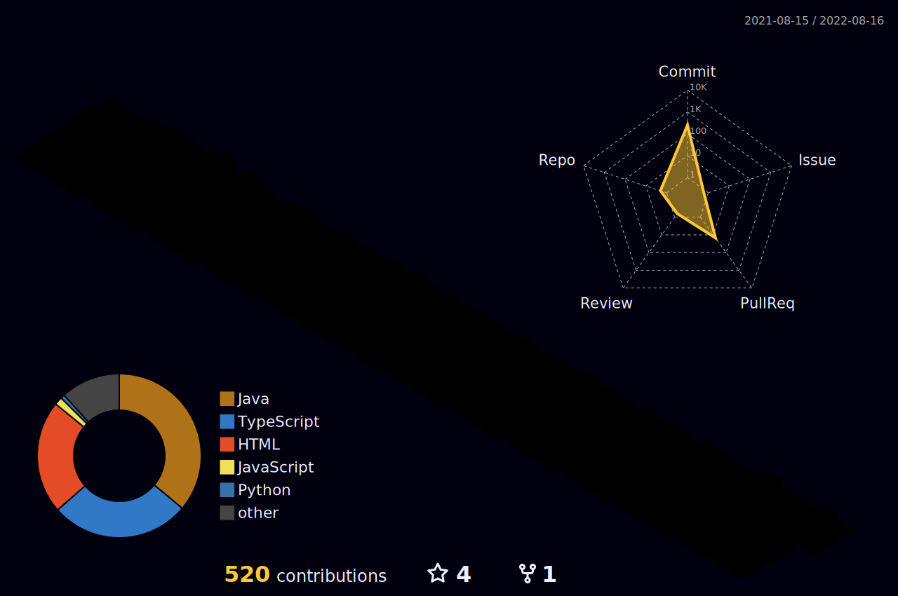

#Feel free to contact me!!!

My name is Felipe Ferreira, I'm from Brazil. I study programming since 2017, I was a PIBITI scholarship holder by the State University of Northern Paraná (UENP) for the year 2020-2021. I am passionate about programming mainly for web and mobile development.

:trophy:
Together with my group in the year 2021 we won third place in the hackathon promoted by Genius.Conecta see the project in the repository <a href="https://github.com/FelipeFerreiraDev/Remapeando_o_campus"> Remapeando o Campus<a>
:3rd_place_medal:
  
In my free time I like to train jiu-jitsu, watch movies, series and talk to my friends about different subjects. Of course, codes are also part of this.

Never stop learning !!!

<b>Languages I'm interested in</b>

 
  
  
  
  
    
  
  
  
 
 
  
  

 
  

<h2>ℹ️ &nbsp;Github Info</h2>
  

  
<b>⚡ Github Stats</b>

   
  

  

    
    
   
  

     
  

  
  
<b>🔎 Github Profile Details</b>

   
  

  
<b>🔥 Github Streaks</b>

   
  

  
<b>📊 Github Contribution Graph</b>

   
  

<!-- 

    -->

  
<b>🏆 Github Achievements</b>

   
  

  

   
   
  
  

<h2>ℹ️ &nbsp;Musics</h2>

  
  

